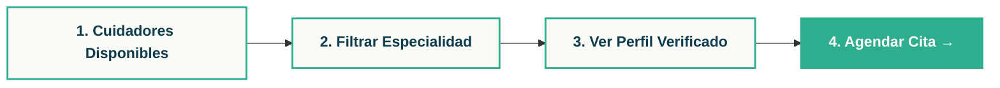
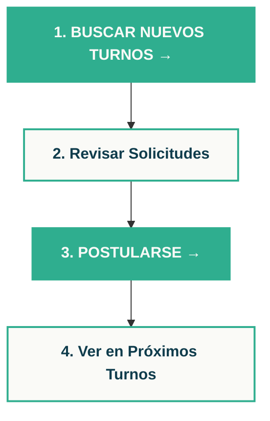

# 📖 Guía Oficial de Uso | BuenCuidar

  
  

    🛡️ CUIDADORES 100% VERIFICADOS
  

---

## 🌟 Nuestra Misión
En **BuenCuidar**, creamos puentes de confianza y afecto. Esta guía te orientará en el uso de nuestras herramientas digitales, diseñadas con la calidez y el respeto que nuestras familias merecen.

---

## 🧭 Centro de Navegación
Utiliza la barra superior (**Navbar**) para moverte entre las secciones principales:
*   **Servicios:** Categorías de apoyo disponibles.
*   **BC PULSO:** Monitoreo y bienestar proactivo.
*   **Mi Panel:** Tu centro de gestión según tu rol.

---

## 🏠 Área Familiar: Gestión del Acompañamiento

  <h3>📍 Pasos para agendar a tu Cuidador</h3>
  

*   **Citas Programadas:** Revisa tus próximos encuentros.
*   **BC Pulso:** Monitoreo en tiempo real para tu tranquilidad.

---

## 💼 Área de Cuidador: Tu Panel de Actividad

  <h3>🚀 Gestión de Turnos y Postulaciones</h3>

*   **Sello de Confianza:** Carga tus documentos en *Formación y Certificaciones* para activar tu distintivo de **CUIDADOR VERIFICADO**.
*   **Reportes&Finanzas:** Gestiona tus ingresos y genera reportes profesionales.

---

## 🛡️ Compromiso BuenCuidar

Nuestra plataforma se aleja de la terminología médica para centrarse en el **Acompañamiento Humano**. Cada "Turno" es un compromiso con la dignidad y el bienestar.

---
